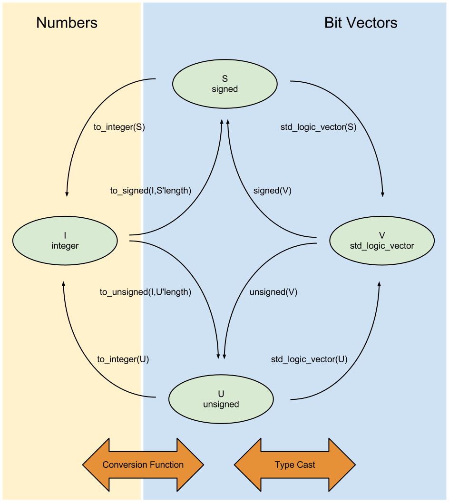

# <div align="center" > VHDL Cheat Sheet</div>
### <div align="right" > By Ismail El Badawy

# Table of Contents
 * [Libraries](#libraries)
 * [Entities](#entities)
 * [Architecture](#architecture)
 * [Process](#process)
 * [Assignment](#assignment)
 * [Type Conversion](#types)
 * [Operators](#operators)


# Libraries

### 0. IEEE
```vhdl
Library ieee;
```

### 1. Standard Logic.
```vhdl
use ieee.std_logic_1164.all;
```

### 2. Math for numerics
```vhdl
use iee.numeric_std.all;
```

# Entities

### 1. Declaring an entity:
Here we declare an entity with Three ports an input port called `FirstPort` an output port called `SecondPort` they are both ``std_logic``.

A third port is used as input with 16 bits.

```vhdl
entity EntityName is 
port (
    FirstPort : in std_logic,
    SecondPort : out std_logic,
    ThirdPort : in std_logic_vector(15 downto 0)
);
end entity;
```

### 2. Generic Entity declaration
Here we declared the entity with two generic integers that can be used throughout the code of the entity.
```vhdl
entity EntityName is
-- generics fit here.
generic (n : integer := 16, m : integer := 32);
port(

);
end entity;
```


# Architecture

### 1. Writing an architecture 
```vhdl
Architecture architecturename of entityname is
begin 

end architecture;
```

### 2. Using intermediary signals
```vhdl
Architecture architecturename of entityname is
-- All signals fit here
Signal wire : std_logic;
Signal bus : std_logic_vector(number downto 0);
begin 

end architecture;
```

### 3. Using an old entity inside an architecture
```vhdl
Architecture architecturename of entityname is
-- Use the entity declaration but instead of the word entity write component.

component componentname is
-- if the component has a generic
generic(n : integer := 16);
port(
    -- port declaration here.
);
end component;

begin

end architecture;
```

# Process

A process is executed sequentially rather than the usual concurrent execution.

### 1. Declare a process
```vhdl
-- Process lies inside an architecure block
Architecture name of entityname is
begin

process(-- sensitivity list
    clk, reset
)
begin
    -- inside the process block you can use conditions.
    if(reset = '0') then
        output <= '0';
    elsif (reset = '1') then
        -- Something
    else
        -- Something
    end if;
-- Process ends with this.
end process;

end architecture;
```

# Assignment
### 1. Normal Assignment
```vhdl
    B <= '0';
```

### 2. Using `when` 
```vhdl
-- Actual code inside archtiecture
B <= "0000" when enable = '0'
	else "0001" when A = "00"
	else "0010" when A = "01"
	else "0100" when A = "10"
	else "1000" when A = "11";
```

# <div id="types">Type Conversion


# Operators

#### Mathematical

#### Logical Operators

# Test Bench
A test bench is an entity with no ports